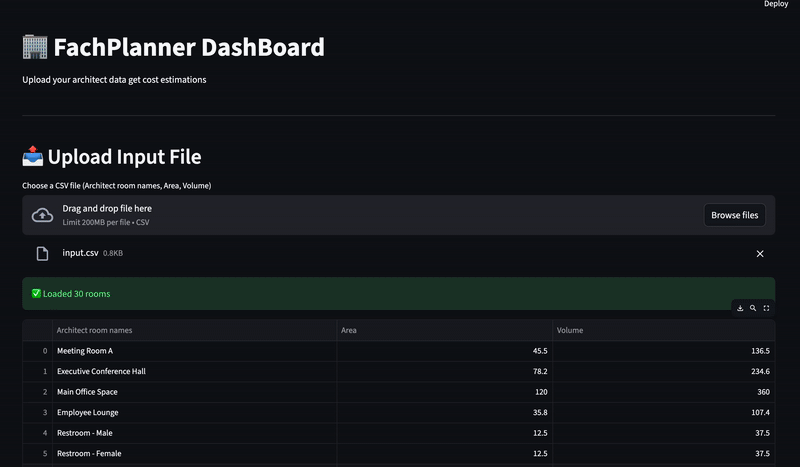

<!-- filepath: /Users/krishuagarwal/Desktop/DataHack/code/README.md -->
# 🏢 FachPlanner

An AI-powered dashboard for automated HVAC (Heating, Ventilation, Air Conditioning) cost estimation using advanced machine learning techniques.



## 🎯 Features

### 🤖 Intelligent Room Classification
- **Hybrid Embeddings**: Combines TF-IDF and semantic embeddings for accurate room type classification 
- **Multi-model Support**: Leverages GPT-4o-mini for context-aware classification
- **Semantic Matching**: Uses multilingual sentence transformers for similarity-based matching

### ⚡ Power Requirements Calculation
- Automatic calculation of cooling (KLT), heating (HLT), and ventilation (RLT) requirements
- Area and volume-based power estimation
- Reference-based capacity planning

### 💰 Cost Estimation
- AI-powered equipment selection using Ollama models
- Detailed cost breakdowns for each HVAC component
- Equipment specifications and pricing analysis

### 🔍 Advanced RAG Pipeline
- **Retrieval-Augmented Generation**: Incorporates domain knowledge for equipment selection
- **FAISS Vector Store**: Fast similarity search with multiple indexing strategies
- **Hybrid Retrieval**: Combines semantic and keyword-based search
- **Experience Integration**: Leverages historical data for better recommendations

### 📊 Interactive Dashboard
- Clean, intuitive Streamlit interface
- Real-time processing and results visualization
- Downloadable reports (CSV and TXT formats)
- Step-by-step analysis display

## 🚀 Quick Start

### Prerequisites

- Python 3.8+
- OpenAI API Key
- Ollama (for local LLM inference)

### Installation

```bash
pip install -e .
```

Or for development:

```bash
pip install -e ".[dev]"
```

For GPU support:

```bash
pip install -e ".[gpu]"
```

### Configuration

Set your OpenAI API key:

```bash
export OPENAI_API_KEY="your-api-key-here"
```

### Running the Dashboard

```bash
streamlit run main.py
```

The dashboard will open in your browser at `http://localhost:8501`

## 📁 Project Structure

```
code/
├── main.py                 # Streamlit dashboard
├── pyproject.toml         # Project configuration & dependencies
├── src/
│   ├── pipeline.py        # Main orchestration pipeline
│   ├── GPTCall.py         # GPT-based classification
│   ├── costCalculations.py # Ollama cost estimation
│   ├── semanticEmbds.py   # Semantic matching & TF-IDF
│   └── ragPipe.py         # Advanced RAG pipeline
├── data/
│   ├── reference.csv      # Reference room types
│   ├── 410.csv           # Cooling equipment data
│   ├── 420.csv           # Heating equipment data
│   └── 430.csv           # Ventilation equipment data
└── output/               # Generated results
```

## 📝 Input Format

Upload a CSV file with the following columns:

```csv
Architect room names,Area,Volume
Meeting Room A,45.5,136.5
Executive Office,25.0,75.0
Restroom,12.5,37.5
```

## 📊 Output

The system generates three types of outputs:

1. **classified_rooms.csv** - Room classifications with confidence scores
2. **power_requirements.csv** - Detailed power calculations for KLT, HLT, RLT
3. **cost_estimates.txt** - Equipment cost breakdowns and total estimates

## 🎓 Why Hybrid Embeddings & RAG?

- **Hybrid Embeddings**: Combines semantic understanding (transformers) with statistical patterns (TF-IDF) for robust classification
- **RAG Pipeline**: Retrieves relevant equipment specifications and historical data to provide context-aware cost estimates
- **OpenAI API**: Required for advanced natural language understanding and generation tasks
